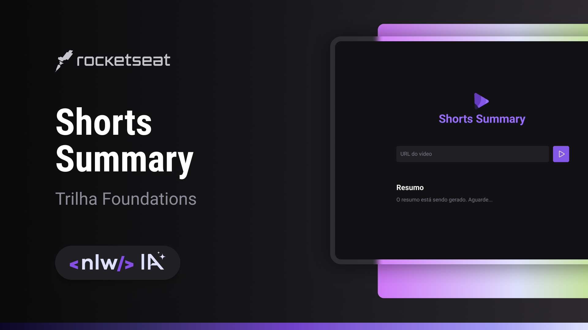

<!-- markdownlint-disable MD033 -->

# `NLW AI || Foundations` - Shorts Summary

   

 

   
   
   
   

 

[**Projeto**](#projeto) &nbsp;&nbsp;**•**&nbsp;&nbsp;
[**Tecnologias**](#tecnologias) &nbsp;&nbsp;**•**&nbsp;&nbsp;
[**Licença**](#licença)

## Projeto

Shorts Summary é uma aplicação web para criar resumo de vídeos shorts do Youtube utilizando Inteligência Artificial para transcrever o conteúdo do vídeo e realizar o resumo do conteúdo. Esse projeto é desenvolvido na trilha Foundations na edição NLW IA.

Acesse análises e comentários sobre o código [AQUI](./.github/docs/_code-index.md).

### Deploy

Indisponível

## Tecnologias

- [`vite`](https://nodejs.org/)
- [`phosphor icons`](https://phosphoricons.com/)

## Licença

Distribuído sob a licença ***MIT***. Veja [LICENSE](LICENSE) para mais informações.  
